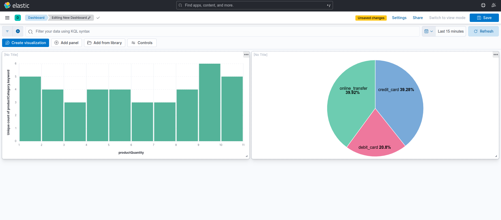

# Real-time ETL Streaming transaction data.

A real-time ETL (Extract, Transform, Load) pipeline utilizing Apache Flink, Apache Kafka, PostgreSQL, Elasticsearch, and Kibana to process and visualize streaming financial transaction data.



---

## 📖 TABLE OF CONTENTS

- [ABOUT](#about)
- [ARCHITECTURE](#architecture)
- [FEATURES](#features)
- [PREREQUISITES](#prerequisites)
- [INSTALLATION](#installation)
- [USAGE](#usage)
- [PROJECT STRUCTURE](#project-structure)
- [TECHNOLOGIES USED](#technologies-used)
- [SCREENSHOTS](#screenshots)
- [CONTRIBUTING](#contributing)
- [LICENSE](#license)
- [CONTACT](#contact)

---

## 📌 ABOUT

This project demonstrates a streaming ETL pipeline that:

1. **Generates** synthetic financial transaction data using a Python script.
2. **Publishes** the data to an Apache Kafka topic.
3. **Processes** the data in real-time with Apache Flink.
4. **Stores** the processed data in PostgreSQL and Elasticsearch.
5. **Visualizes** the data using Kibana dashboards.

---

## 🏗️ ARCHITECTURE

The pipeline follows this flow:

1. **Data Generation**:
   - A Python script (`main.py`) generates synthetic financial transactions and sends them to a Kafka topic.

2. **Data Processing**:
   - Apache Flink consumes data from the Kafka topic, processes it, and writes the results to PostgreSQL and Elasticsearch.

3. **Data Storage**:
   - Processed data is stored in PostgreSQL for structured queries and in Elasticsearch for full-text search and analytics.

4. **Data Visualization**:
   - Kibana connects to Elasticsearch to provide real-time dashboards and visualizations.

---

## ✨ FEATURES

- Real-time data generation and ingestion.
- Stream processing with Apache Flink.
- Dual data storage in PostgreSQL and Elasticsearch.
- Real-time data visualization with Kibana.
- Dockerized setup for easy deployment.

---

## ✅ PREREQUISITES

Before you begin, ensure you have met the following requirements:

- Docker and Docker Compose installed on your machine.
- Python 3.7 or higher installed.
- Java Development Kit (JDK) installed.
- Maven installed for building the Flink application.

---

## 🚀 INSTALLATION

1. **Clone the repository**:

   ```bash
   git clone https://github.com/sethuaung/Kibana_Dashboard_ETL.git
   cd Kibana_Dashboard_ETL
   ```

2. **Start the Docker containers**:

   ```bash
   docker-compose up --build
   ```

   This will set up Kafka, Zookeeper, PostgreSQL, Elasticsearch, and Kibana containers.

3. **Install Python dependencies**:

   ```bash
   pip install confluent_kafka simplejson
   ```

---

## 🛠️ USAGE

1. **Verify Kafka is running**:

   ```bash
   docker exec -it broker /bin/bash
   kafka-topics --list --bootstrap-server broker:9092
   ```

2. **Run the data generator**:

   ```bash
   python main.py
   ```

   This script will produce synthetic financial transactions to the Kafka topic `financial_transactions`.

3. **Consume messages from Kafka (optional)**:

   ```bash
   docker exec -it broker /bin/bash
   kafka-console-consumer --topic financial_transactions --bootstrap-server broker:9092 --from-beginning
   ```

4. **Develop and run the Flink application**:

   - Create a new Maven project in IntelliJ IDEA or your preferred IDE.
   - Implement the Flink job to consume data from Kafka and write to PostgreSQL and Elasticsearch.
   - Build the project using Maven:

     ```bash
     mvn clean package
     ```

   - Submit the Flink job to the Flink cluster.

5. **Access Kibana Dashboard**:

   - Navigate to `http://localhost:5601` in your browser.
   - Use the predefined dashboards or create new visualizations based on the ingested data.

---

## 📁 PROJECT STRUCTURE

```bash
Kibana_Dashboard_ETL/
├── docker-compose.yml        # Docker Compose configuration
├── main.py                   # Python script to generate and send data to Kafka
├── kibanaDashboard.png       # Screenshot of Kibana dashboard
├── README.md                 # Project documentation
```

---

## 🧰 TECHNOLOGIES USED

- **Apache Kafka**: Distributed event streaming platform.
- **Apache Flink**: Stream processing framework for real-time data processing.
- **PostgreSQL**: Relational database for structured data storage.
- **Elasticsearch**: Search and analytics engine.
- **Kibana**: Visualization tool for Elasticsearch data.
- **Docker & Docker Compose**: Containerization and orchestration tools.
- **Python**: Programming language for data generation script.

---

## 📸 SCREENSHOTS

**Kibana Dashboard**:


---

## 🤝 CONTRIBUTING

Contributions are welcome! To contribute:

1. **Fork** the repository.
2. **Create** a new branch: `git checkout -b feature/your-feature-name`.
3. **Commit** your changes: `git commit -m 'Add some feature'`.
4. **Push** to the branch: `git push origin feature/your-feature-name`.
5. **Submit** a pull request.

Please ensure your code adheres to the project's coding standards and includes relevant tests.

---

## 📄 LICENSE

This project is licensed under the [MIT License](LICENSE).

---

## 📬 CONTACT

**James**  
GitHub: [@sethuaung](https://github.com/sethuaung)

---
